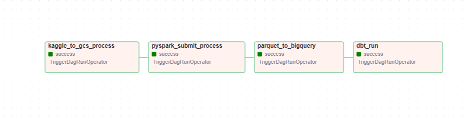
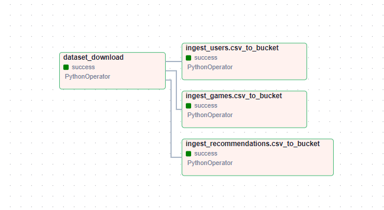
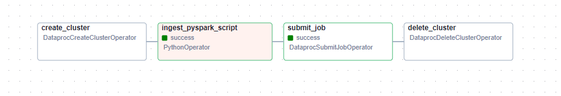
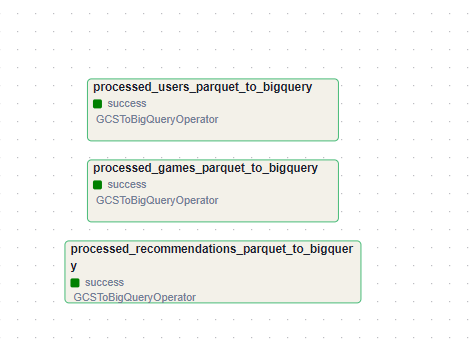
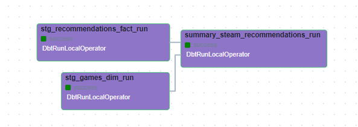

## ¿ Why Apache Airflow as orchestrator ? 
Apache Airflow streamlines workflow orchestration with scalable DAGs, ensuring efficient task coordination and dependency management. Its extensibility supports seamless integration with diverse data sources and systems. The platform offers robust monitoring, alerting, and version control, empowering data engineers to automate workflows effectively. With a vibrant community and extensive ecosystem, Airflow stands as a top choice for managing data pipelines and optimizing data processing workflows.

## Definition of each dag of the project 

**1_dag_master:**
The master DAG assumes the pivotal role of triggering all subsequent DAGs, reflecting our commitment as data engineers to automate manual processes across various stages of the data project lifecycle. The creation of this master DAG underscores our strategic approach to orchestrate seamless automation, ensuring efficiency and reliability throughout our data engineering workflows.

**2_kaggle_to_gcs:**
This DAG ingest the datasets from kaggle to the bucket 
At the end of this process we should have 3 csv files (raw folder)

**3_pyspark_submit_process:**
* This dag is responsible of ingest the pyspark_transform.py to the bucket script folder
* Create a Dataproc cluster to process large volumes of data 
* submit the job on the cluster running the pyspark script from (dtc_data_lake_steam/script) 
* Delete the cluster after the pyspark tranformation is done (dtc_data_lake_steam/processed)

**4_parquet_to_bigquery:**
This dag ingest all the parquet files to bigquery for each dataset (games,recommendations,users)

**5_dbt_run:**
This DAG orchestrates the execution of a DBT model operating on BigQuery

